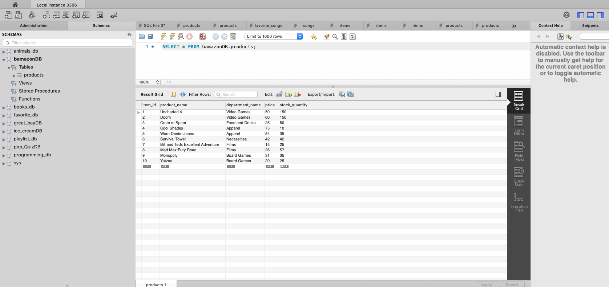
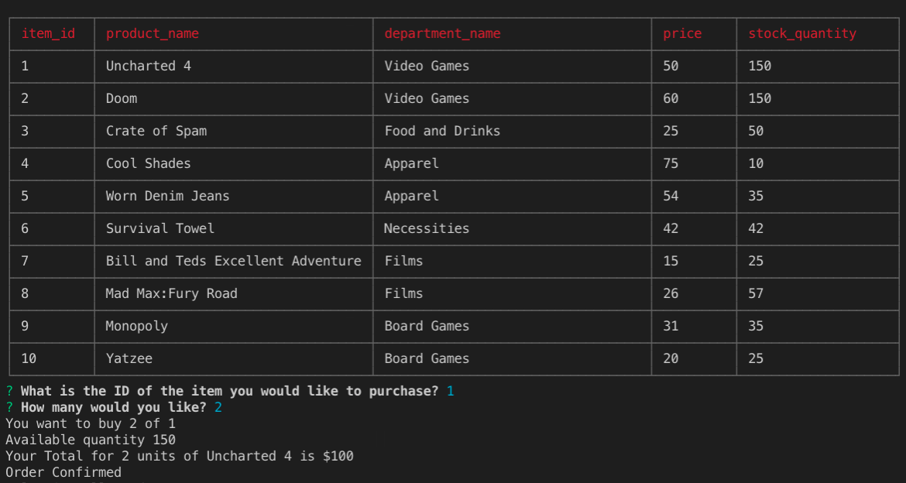

# bamazon
- Bamazon is a Amazon like storefront. This app will take provide a listing of products available for sale and also take orders from the customers.

## How it works
  - MySQL has a bamazonDB with a products table which contains a listing of the products,department,price and available quantity.
  - Using inquirer node package the customer is asked questions and the response accepted and the order is placed or message displayed to the customer of insufficient quantity.
  - Based on the quantity ordered the database is updated to reflect the reduced quantity after the sale.
  

## Tools Used

- [Visual Studio Code](#vscode)
- [Chrome Browser](#chrome)
- [GitLab](https://ucb.bootcampcontent.com/)
- [GitHub](https://github.com/)
- [W3Schools](https://www.w3schools.com/default.asp)
- [SlackForum] (#slackforum)
- [StackOver Flow](https://stackoverflow.com/)
- [MySQL] (https://dev.mysql.com/downloads/mysql/)
- [MySQL WorkBench](https://dev.mysql.com/downloads/workbench/)

## Core Technologies Used
- JavaScript
- Node JS

 
## NPM packages used
- [Inquirer] (https://www.npmjs.com/package/inquirer)
- [CLI Table](https://www.npmjs.com/package/cli-table)
- [mysql](https://www.npmjs.com/package/mysql)

## Challenges and learnings in getting this to work:
 - Getting the cli-table to display correctly took a few tries to get it right. 
 - More comfortable now in using multiple node packages together.
 - More confident with the data manipulations.
 - View of the mysql bamazonDB:

- Customer view and questions asked:

